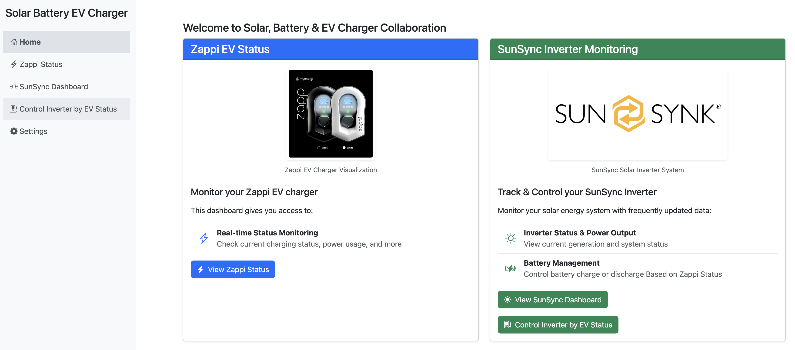
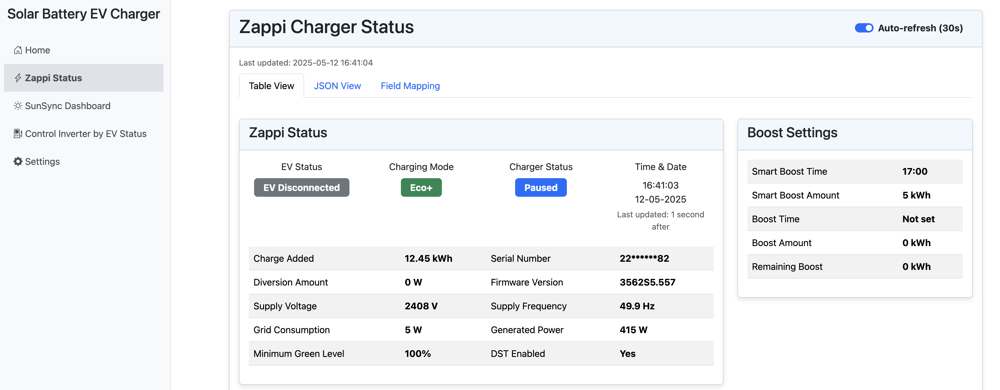
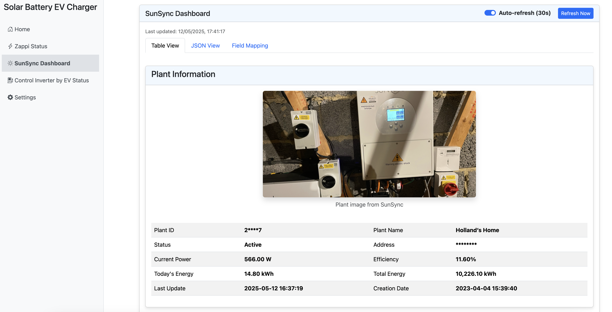
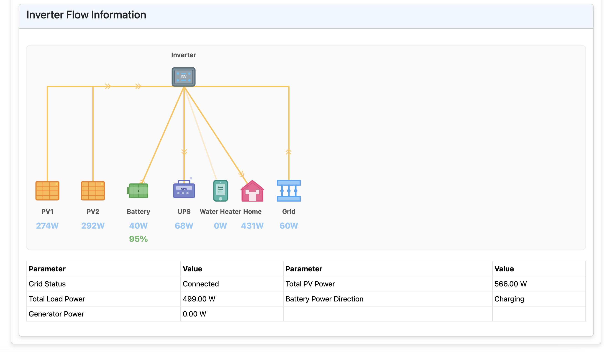
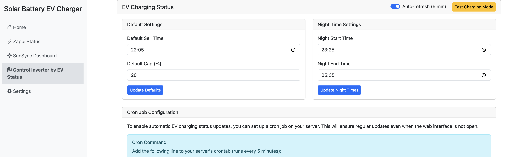

# Solar Batteries EV Charger Management System

A comprehensive Laravel-based web application for managing solar battery systems and EV charging stations. This system provides real-time monitoring, control, and optimization of solar power generation, battery storage, and electric vehicle charging.

## Features

- **Solar System Monitoring**
  - Real-time solar power generation tracking
  - Performance analytics and reporting
  - Weather integration for solar forecasting
  - SunSync inverter integration for detailed system monitoring

- **Battery Management**
  - Battery state monitoring
  - Charge/discharge optimization
  - Battery health tracking
  - Storage capacity management
  - SunSync battery system integration

- **EV Charging Control**
  - Smart charging scheduling
  - Power distribution optimization
  - Charging station status monitoring
  - User authentication and access control
  - Zappi EV charger integration

- **Energy Management**
  - Grid integration monitoring
  - Power flow optimization
  - Energy cost tracking
  - Consumption analytics
  - Real-time power flow visualization

## Visual Examples

Below are screenshots of the main dashboard and features:

### Home Dashboard


### Zappi Charger Status


### SunSync Dashboard


### Inverter Flow Information


### EV Charging Status


### API & Settings


## Technology Stack

- **Backend**: Laravel 10.x
- **Frontend**: Bootstrap 5, JavaScript
- **Database**: MySQL
- **Real-time Updates**: Laravel WebSockets
- **Authentication**: Laravel Sanctum
- **API**: RESTful API architecture
- **External Integrations**: 
  - SunSync API
  - Zappi API

## Requirements

- PHP 8.2 or higher
- Composer
- MySQL 8.0 or higher
- Node.js and NPM
- Web server (Apache/Nginx)

## Installation

1. Clone the repository:
```bash
git clone https://github.com/yourusername/solar-batteries-evcharger.git
cd solar-batteries-evcharger
```

2. Install PHP dependencies:
```bash
composer install
```

3. Install JavaScript dependencies:
```bash
npm install
```

4. Create environment file:
```bash
cp .env.example .env
```

5. Generate application key:
   - Visit `/setup.php` in your browser
   - Click "Generate New Key" button
   - The system will automatically create/update your .env file

6. Configure your database in `.env` file

7. Run migrations:
```bash
php artisan migrate
```

8. Start the development server:
```bash
php artisan serve
```

## Configuration

1. Update the `.env` file with your specific configuration:
   - Database credentials
   - Solar system parameters
   - EV charger settings
   - API keys for weather services
   - SunSync API credentials
   - Zappi API credentials

2. Configure your web server to point to the `public` directory

## API Integrations

### SunSync API Integration
The system integrates with the SunSync API to monitor and control your solar inverter system. The API provides access to:
- Real-time power flow data
- Battery status and control
- System settings and configuration
- Historical data and analytics

API Documentation: [SunSync API Documentation](https://documenter.getpostman.com/view/44822306/2sB2j98oxr)

Key Endpoints:
- Authentication: `POST /oauth/token`
- Plant Information: `GET /api/v1/plants`
- Inverter Status: `GET /api/v1/inverter/{sn}/flow`
- System Settings: `GET /api/v1/common/setting/{sn}/read`

### Zappi API Integration
The system integrates with the Zappi API to manage your EV charging station. The API provides:
- Real-time charging status
- Charging control and scheduling
- Power consumption monitoring
- Device configuration

API Documentation: [Zappi API Documentation](https://documenter.getpostman.com/view/44822306/2sB2j999kM)

Key Endpoints:
- Device Status: `GET /cgi-jstatus-Z{serialNumber}`
- Authentication: Digest authentication with API key

## Usage

1. Access the web interface at `http://localhost:8000`
2. Log in with your credentials
3. Navigate through the dashboard to monitor and control your solar battery system and EV chargers
4. Configure your SunSync and Zappi devices through the settings panel

## Security

- All API endpoints are protected with Laravel Sanctum
- CSRF protection enabled
- Input validation and sanitization
- Secure password hashing
- Rate limiting on API endpoints
- Secure API key storage
- Encrypted communication with external APIs

## Contributing

1. Fork the repository
2. Create your feature branch (`git checkout -b feature/AmazingFeature`)
3. Commit your changes (`git commit -m 'Add some AmazingFeature'`)
4. Push to the branch (`git push origin feature/AmazingFeature`)
5. Open a Pull Request

## License

This project is licensed under the MIT License - see the [LICENSE](LICENSE) file for details.

## Support

For support, please open an issue in the GitHub repository or contact the development team.

## Acknowledgments

- Laravel Framework
- Bootstrap
- SunSync API
- Zappi API
- All contributors who have helped shape this project
