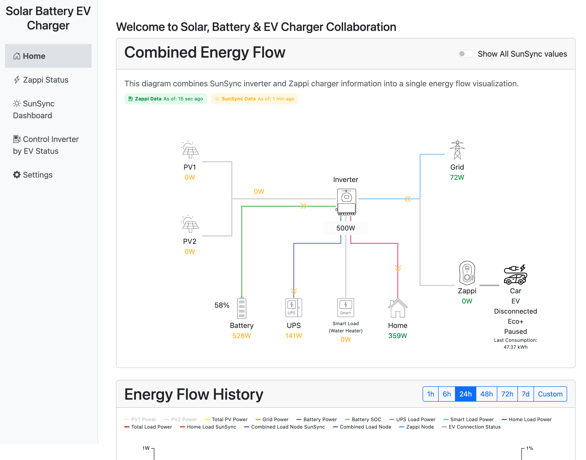
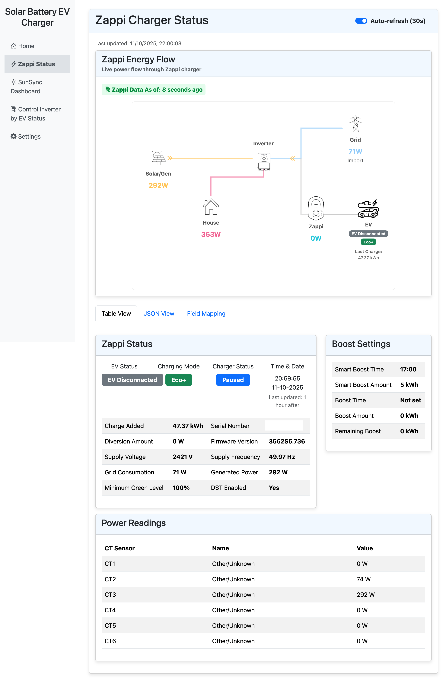
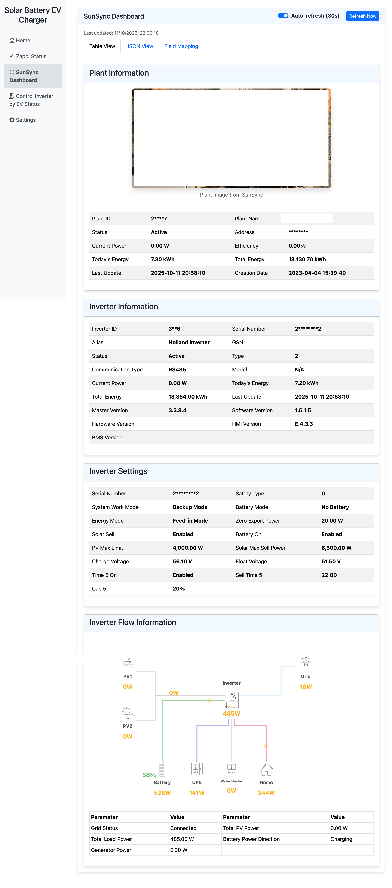
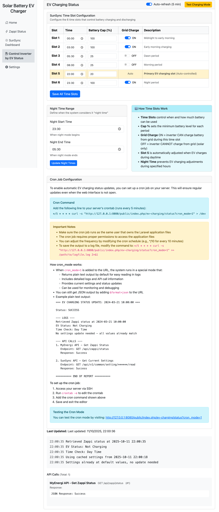
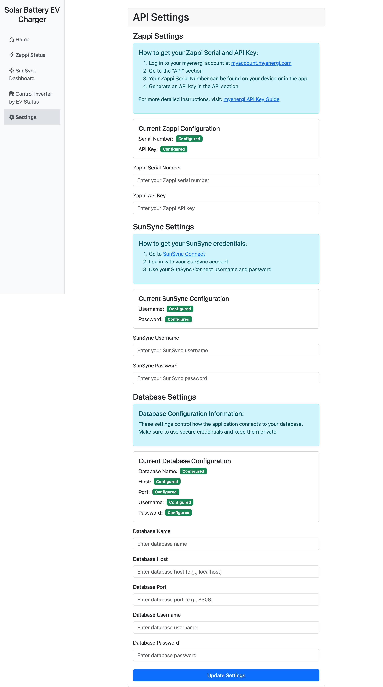
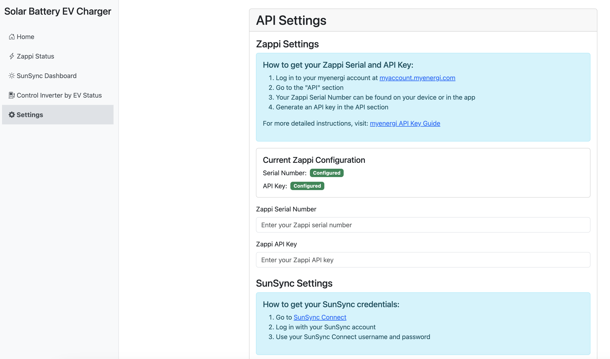
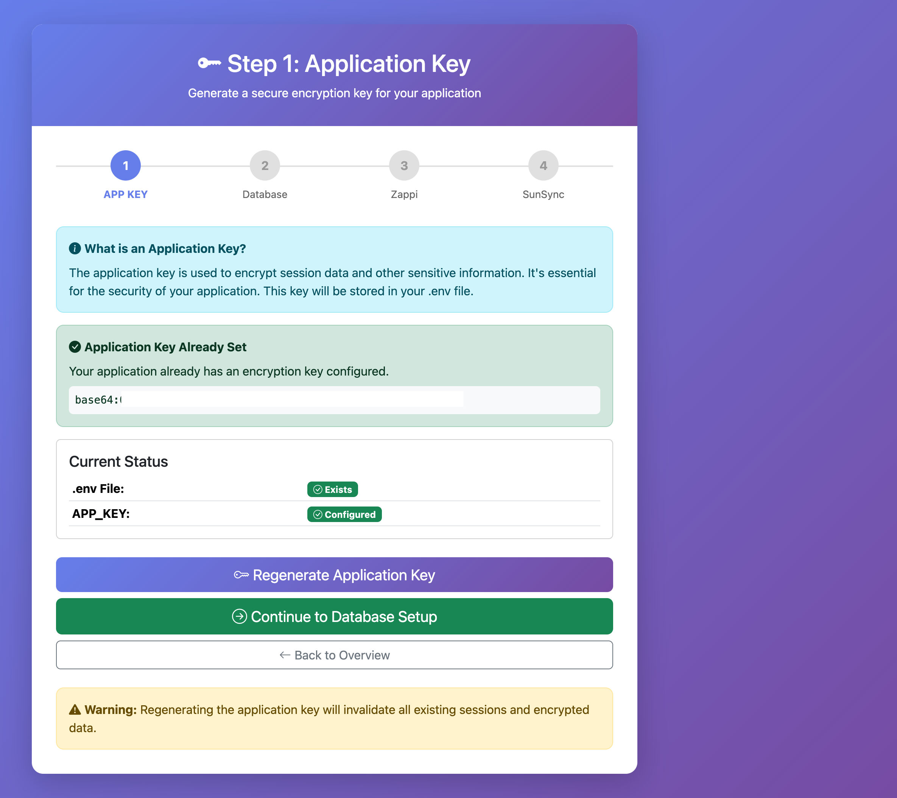
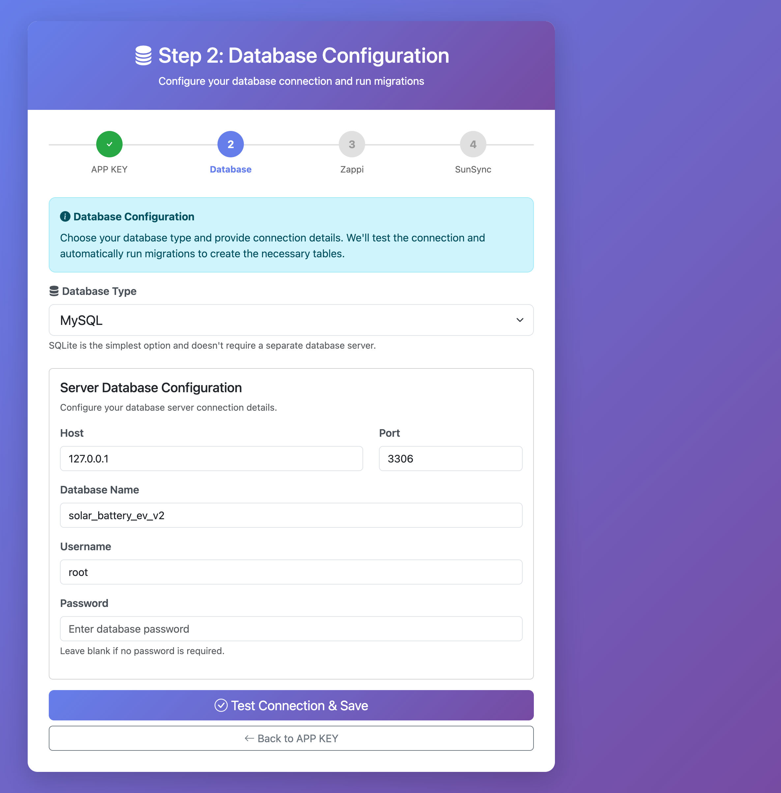
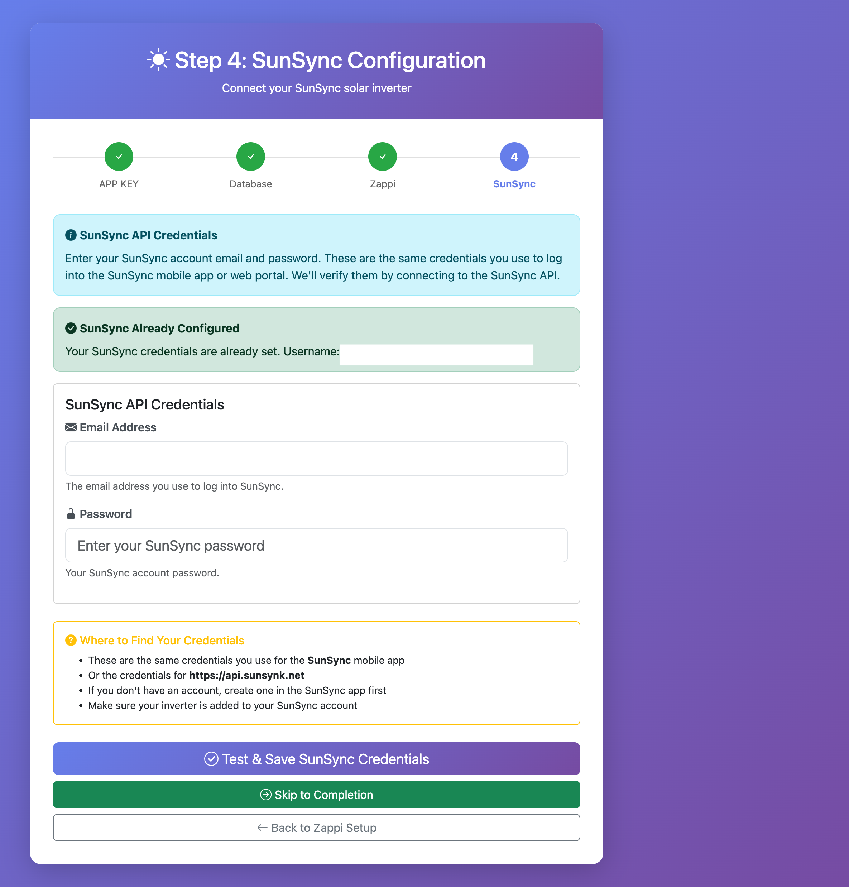

# Solar Batteries EV Charger Management System

A comprehensive Laravel-based web application for managing and monitoring solar power systems, battery storage, and EV charging stations. This system provides a unified dashboard for real-time monitoring, intelligent control, and optimization of your complete home energy ecosystem.

## 🌟 What is This Application?

This application is a **unified energy management platform** that integrates multiple renewable energy systems into a single, easy-to-use interface. It's designed for homeowners and businesses who have:

- **Solar panels** generating renewable electricity
- **Battery storage systems** (SunSync inverters) for storing excess solar energy
- **Electric vehicle chargers** (Zappi devices) for charging EVs
- A desire to **optimize energy usage** and reduce reliance on the grid

### Key Benefits

✅ **Real-Time Visibility** - See exactly where your energy is coming from and going to, in real-time  
✅ **Smart Optimization** - Automatically manage battery charging and EV charging based on solar generation  
✅ **Battery Discharge to Grid** - Intelligently discharge excess battery power to the grid during peak hours  
✅ **Cost Reduction** - Maximize use of free solar energy and minimize grid consumption  
✅ **Historical Analytics** - Track your energy production, consumption, and savings over time  
✅ **Remote Control** - Manage your system from anywhere via the web interface  
✅ **Unified Dashboard** - One place to monitor all your energy systems instead of multiple apps  
✅ **Inverter Status Monitoring** - Always see your inverter current operating mode  

---

## 📸 Screenshots & Features

### Combined Energy Flow Dashboard
The home dashboard provides a comprehensive real-time view of your entire energy ecosystem:



**Features:**
- Live power flow visualization showing PV generation, battery state, grid import/export, EV charging
- Real-time status indicators for all devices
- Instant visibility of where energy is flowing
- Historical data charts with customizable time ranges
- Responsive design that works on all devices

### Zappi EV Charger Status
Monitor and control your EV charging:



**Features:**
- Real-time charging status and power level
- Smart charging modes (Eco, Eco+, Fast)
- Power flow visualization with Zappi integration
- CT sensor readings
- Boost settings and schedule management
- Integration with solar generation for eco-friendly charging

### SunSync Inverter Dashboard
Detailed monitoring of your solar inverter and battery system:



**Features:**
- Battery state of charge (SOC) with real-time updates
- PV generation monitoring (PV1 and PV2)
- Grid import/export tracking
- Inverter power flow visualization
- Complete plant and inverter information
- System settings and configuration display

### EV Charging Control
Intelligent EV charging management based on solar generation:



**Features:**
- Time slot configuration for battery management
- Automatic inverter control based on EV charging status
- Night time range settings
- Grid charge control per time slot
- **Battery discharge to grid feature** with smart scheduling
- Real-time inverter status display (model, mode, serial number)
- Detailed logging and API call tracking
- Cron job setup instructions for automation

### Settings & Configuration
Secure configuration management:



**Features:**
- API credentials management (all sensitive data marked as "Configured")
- Zappi serial number and API key configuration
- SunSync username and password settings
- Database connection configuration
- Step-by-step guidance for obtaining credentials
- All passwords and keys are masked for security

### Reports & Analytics
Comprehensive energy analytics and cost tracking:

**Features:**
- System overview statistics (total records, days of data, max solar generation)
- Home usage analytics with statistical breakdown
- Energy distribution charts (solar, grid, battery)
- Load distribution analysis
- Solar yield tracking over time
- Battery efficiency monitoring
- Grid interaction trends (import/export)
- EV charging activity patterns
- **Cost breakdown** with peak/off-peak pricing
- **Daily cost trends** for financial tracking
- Customizable date ranges (7, 14, 30, 60, 90 days, YTD, All Time)
- Real-time data updates every 15 minutes via automated ETL

**Performance Optimizations:**
- 45x faster cost calculations (18.9s → 423ms)
- Pre-computed data aggregates (daily and 15-minute buckets)
- Fast database queries with optimized indexing
- Responsive charts and visualizations

---

## 🛠️ Technology Stack

- **Backend Framework**: Laravel 12.x (PHP 8.2+)
- **Frontend**: Bootstrap 5, Vanilla JavaScript
- **Database**: SQLite (development) / MySQL 8.0+ (production)
- **Authentication**: Secure session-based auth
- **API Integrations**: 
  - SunSync API (Solar Inverter & Battery)
  - MyEnergi Zappi API (EV Charger)
- **Caching**: Laravel Cache for API response optimization

---

## 📋 Requirements

### Hosting Requirements

Your cPanel hosting account must have:

- **PHP 8.2 or higher** - Check in cPanel under "Select PHP Version"
- **MySQL 5.7+** or **MariaDB 10.3+** - Usually available in all cPanel accounts
- **Composer** - Either installed on server or accessible via SSH/Terminal
- **HTTPS/SSL** - Recommended for secure API communications (free Let's Encrypt in cPanel)
- **Adequate Storage** - At least 500MB for application + database growth
- **Memory Limit** - PHP memory_limit of at least 256MB (check in cPanel PHP settings)

**Recommended PHP Extensions** (usually enabled by default):
- OpenSSL
- PDO
- Mbstring
- Tokenizer
- XML
- Ctype
- JSON
- BCMath

**Optional but Helpful:**
- SSH/Terminal access for easier management
- Cron job support for scheduled tasks
- Git support (if available)

### External Hardware/Services Required

- **SunSync Solar Inverter** - With API access enabled
- **MyEnergi Zappi EV Charger** - With API credentials
- API credentials for both services (obtained from respective providers)

**Note:** Your hosting server needs to be able to make outbound HTTPS connections to external APIs (SunSync and MyEnergi). Most hosting providers allow this by default.

---

## 🚀 Installation & Setup

### Quick Start - cPanel Hosting Setup

This application is designed to run on any standard PHP hosting with cPanel. Follow these steps to get your system up and running:

### 1️⃣ Upload Files to Your Server

**Option A: Using cPanel File Manager (Easiest)**
1. Download the repository as a ZIP file from GitHub
2. Log into your cPanel account
3. Open **File Manager**
4. Navigate to your web root (usually `public_html` or `www`)
5. Upload and extract the ZIP file
6. Move all files from the extracted folder to your web root

**Option B: Using FTP**
1. Download the repository as a ZIP file and extract locally
2. Connect via FTP (FileZilla, etc.)
3. Upload all files to your web root directory

**Option C: Using Git (If SSH access available)**
```bash
cd public_html
git clone https://github.com/yourusername/solar-batteries-evcharger.git .
```

### 2️⃣ Install PHP Dependencies

**If you have SSH/Terminal access in cPanel:**
```bash
cd public_html
composer install --no-dev --optimize-autoloader
```

**If you don't have terminal access:**
- Contact your hosting provider to run `composer install`
- Or use cPanel's **Terminal** feature (if available)
- Some hosts have a PHP Composer tool in cPanel

### 3️⃣ Set Up Web Root

In cPanel, configure your domain to point to the `public` directory:

1. Go to **Domains** or **Addon Domains** in cPanel
2. Set the document root to `/public_html/public` (or wherever your `public` folder is)
3. This ensures Laravel's routing works correctly

**Important:** The `public` folder should be your web root, not the main application folder.

### 4️⃣ Set File Permissions

Using cPanel File Manager or FTP:
- Set `storage` folder to **755** or **775**
- Set `bootstrap/cache` folder to **755** or **775**
- Set `.env` file (when created) to **600** or **644**

**Via SSH (if available):**
```bash
chmod -R 775 storage bootstrap/cache
chmod 600 .env
```

### 5️⃣ Complete the Setup Wizard

Open your browser and navigate to your domain (e.g., `https://yourdomain.com`)

You'll be automatically redirected to the **Setup Wizard** at `/setup` which will guide you through:

1. ✅ **Application Key Generation** - Creates a secure encryption key
2. ✅ **Database Configuration** - Connects to your cPanel MySQL database
3. ✅ **Zappi Credentials** - Connects to your EV charger
4. ✅ **SunSync Credentials** - Connects to your solar inverter



The wizard will:
- Automatically create the `.env` configuration file
- Test all database connections
- Run database migrations automatically
- Validate API credentials
- Guide you to the dashboard when complete

**That's it!** Once the setup wizard is complete, you'll have full access to your energy monitoring dashboard.

---

## 🎯 Setup Wizard Details

The Setup Wizard provides a simple, visual interface to configure your application. Here's what you'll need:

### Step 1: Application Key



**What it does:** Generates a secure encryption key for your Laravel application

**Action:** Simply click "Generate Application Key" - done automatically! The wizard will show you the generated key and confirm it's been saved to your `.env` file.

### Step 2: Database Setup



**What you'll need:**

Create a MySQL database in cPanel first:

1. Log into your cPanel account
2. Go to **MySQL Databases** or **MySQL Database Wizard**
3. Create a new database (e.g., `yourusername_solar`)
4. Create a database user with a strong password
5. Add the user to the database with **ALL PRIVILEGES**
6. Note down these details:
   - **Database Host:** Usually `localhost` (check with your host)
   - **Database Name:** The full name including prefix (e.g., `yourusername_solar`)
   - **Database Username:** The full username including prefix
   - **Database Password:** The password you created

**Enter these details in the Setup Wizard:**
- Choose your database type (SQLite, MySQL, MariaDB, or PostgreSQL)
- Enter your connection details
- The wizard will test the connection
- Automatically run all database migrations
- Create the necessary tables for your energy data

**What it does:** Tests connection and runs all database migrations

### Step 3: Zappi EV Charger Setup


> ⚠️ **Note:** The screenshot above contains an actual serial number. If sharing this publicly, please mask or blur sensitive information.

**What you'll need:**
- **Serial Number** - Found on your Zappi device or in the MyEnergi app
- **API Password** - Your MyEnergi Hub API password

**Where to find credentials:**
1. Open the MyEnergi app
2. Navigate to: Settings → Hub Settings
3. Note your Hub Serial Number
4. Generate or retrieve your API password

**What it does:** Tests connection to your Zappi device and validates your credentials

### Step 4: SunSync Inverter Setup



> ⚠️ **Note:** The screenshot above contains an actual email address. If sharing this publicly, please mask or blur sensitive information.

**What you'll need:**
- **Email Address** - Your SunSync account email
- **Password** - Your SunSync account password

**Where to get credentials:**
- Use the same credentials as your SunSync mobile app
- Or your login for https://api.sunsynk.net
- If you don't have an account, create one in the SunSync app first
- API docs: [SunSync API Documentation](https://documenter.getpostman.com/view/44822306/2sB2j98oxr)

**What it does:** Tests connection to SunSync API and retrieves your plant and inverter information

### Setup Complete! 🎉

Once all steps are validated, you'll be automatically redirected to your energy monitoring dashboard where you can start tracking your solar generation, battery status, and EV charging in real-time!

---

## 🔐 User Authentication

After the initial setup, the application requires login credentials to access the dashboard and manage your system.

### Login Credentials

The application uses the **same credentials as your SunSync account**:

- **Username**: Your SunSync username (`SUNSYNC_USERNAME` from `.env`)
- **Password**: Your SunSync password (`SUNSYNC_PASSWORD` from `.env`)

**Note:** These are the credentials you use to log into the SunSync mobile app or the SunSync web portal at https://api.sunsynk.net.

### Accessing the Application

1. Navigate to your domain (e.g., `https://yourdomain.com`)
2. You'll be redirected to the login page if not authenticated
3. Enter your SunSync username and password
4. Click "Sign In" to access the dashboard

### Security Features

- **Session-based authentication** - Secure session management
- **Remember me** - Option to stay logged in (optional)
- **Auto-logout** - Automatic logout button in the sidebar
- **CSRF protection** - All forms protected against cross-site request forgery
- **Rate limiting** - Prevents brute force attacks

---

## ⚙️ Manual Configuration (Advanced)

If you need to manually edit configuration, you can do so through cPanel File Manager or FTP:

### Editing .env File

1. In cPanel **File Manager**, navigate to your application root
2. Find and edit `.env` file (enable "Show Hidden Files" in Settings)
3. Or use your favorite FTP client to download, edit, and upload

### Database Configuration (MySQL)

```env
# Application
APP_NAME="Solar Battery EV Charger"
APP_ENV=production
APP_KEY=base64:your_key_here
APP_DEBUG=false
APP_URL=https://yourdomain.com

# Database - Use your cPanel database credentials
DB_CONNECTION=mysql
DB_HOST=localhost
DB_PORT=3306
DB_DATABASE=yourusername_solardb
DB_USERNAME=yourusername_solaruser
DB_PASSWORD=your_secure_password
```

**Important:** 
- Use the full database name with prefix (e.g., `yourusername_solardb`)
- Use the full database username with prefix
- Set `APP_DEBUG=false` for production
- Set `APP_ENV=production`

### API Configuration

```env
# MyEnergi Zappi Configuration
ZAPPI_SERIAL=12345678
ZAPPI_PASSWORD=your_zappi_password

# SunSync Configuration
SUNSYNC_CLIENT_ID=your_client_id
SUNSYNC_CLIENT_SECRET=your_client_secret  
SUNSYNC_USERNAME=your_email@example.com
SUNSYNC_PASSWORD=your_sunsync_password

# Cache Settings (optional)
SUNSYNC_CACHE_TTL=60
```

### Run Migrations Manually

If you have SSH/Terminal access:
```bash
cd /home/yourusername/public_html
php artisan migrate --force
```

The `--force` flag is required in production environments.

### Generate Application Key Manually

If needed:
```bash
php artisan key:generate --force
```

---

## 🔒 Security & Sensitive Information

### Protecting Sensitive Data

This application handles sensitive information including:
- API credentials
- Serial numbers
- Account passwords

**Best Practices:**

1. **Never commit `.env` file** - Already in `.gitignore`, but double-check
2. **Use environment variables** - Store all secrets in `.env`, never hardcode
3. **Mask data in UI** - The settings page automatically masks passwords (shows `••••••••`)
4. **Restrict access** - Use proper file permissions on your server
5. **Regular backups** - Backup your `.env` file securely (encrypted)

### Screenshot Privacy

When sharing screenshots:
- ✅ Settings page automatically masks passwords
- ✅ Serial numbers and credentials are hidden by default
- ⚠️ Be cautious with dashboard screenshots showing personal data
- ⚠️ Redact any personal identifiers before sharing publicly

### Production Deployment

For production environments:
```bash
# Set proper permissions
chmod 600 .env

# Ensure storage is writable
chmod -R 775 storage bootstrap/cache

# Optimize for production
php artisan config:cache
php artisan route:cache
php artisan view:cache
```

---

## 📊 Database Structure

The system uses an optimized database structure for efficient energy data logging:

### Key Features

- **Compressed row format** - Reduces storage space by up to 50%
- **Optimized data types** - Decimal precision for accurate energy measurements
- **Smart indexing** - Fast queries on timestamp and device ID columns  
- **Automatic timestamps** - Created/updated tracking for all records
- **Efficient varchar lengths** - Optimized field sizes for status fields

### Main Tables

- `energy_flow_logs` - Real-time power flow data (PV, battery, grid, EV)
- `ev_charging_settings` - EV charging mode and schedule configuration
- `sun_sync_settings` - Solar inverter settings and preferences
- `cost_settings` - Tariff configuration for cost calculations

### Data Mart (Analytics)

The system includes a data mart for fast analytics and reporting:

**Dimension Tables:**
- `dim_date` - Date dimension with calendar attributes (year, month, week, weekend flags)
- `dim_time` - Time dimension with daypart classification (morning, afternoon, evening, night)

**Fact/Aggregate Tables:**
- `agg_energy_15min` - 15-minute aggregated power flows (grid, PV, home load, battery, EV)
- `agg_energy_daily` - Daily aggregated power flows and sample counts

**Benefits:**
- **45x faster** cost calculations by pre-aggregating data
- **Efficient storage** - Reduced storage requirements via aggregation
- **Fast queries** - Indexed for quick time-range filtering
- **Automated refresh** - ETL runs every 15 minutes via scheduler

### Data Retention

The database is designed to handle:
- **High-frequency logging** - Data points every 5-10 seconds
- **Long-term storage** - Years of historical data
- **Fast retrieval** - Optimized queries for dashboard display
- **Minimal storage** - Compressed format saves disk space

---

## 🔌 API Integrations

This application integrates with two external APIs to provide unified monitoring and control.

### SunSync API Integration

**Purpose:** Monitor and control your solar inverter and battery system

**Capabilities:**
- Real-time power flow data (PV generation, battery charge/discharge, grid import/export)
- Battery status and state of charge (SOC)
- System settings and configuration
- Load management and smart device control
- Historical data and analytics

**API Documentation:** [SunSync API Docs](https://documenter.getpostman.com/view/44822306/2sB2j98oxr)

**Authentication:** OAuth 2.0 with client credentials

**Key Endpoints:**
```
POST /oauth/token                          # Get access token
GET  /api/v1/plants                        # List all plants
GET  /api/v1/inverter/{sn}/flow           # Real-time power flow
GET  /api/v1/common/setting/{sn}/read     # System settings
POST /api/v1/common/setting/{sn}/write    # Update settings
```

### MyEnergi Zappi API Integration

**Purpose:** Manage your EV charging station

**Capabilities:**
- Real-time charging status and power level
- Charging mode control (Eco, Eco+, Fast, Stop)
- Power consumption monitoring
- Device configuration and settings
- Charging history

**API Documentation:** [Zappi API Docs](https://documenter.getpostman.com/view/44822306/2sB2j999kM)

**Authentication:** HTTP Digest Authentication

**Key Endpoints:**
```
GET /cgi-jstatus-Z{serialNumber}    # Device status and power data
GET /cgi-jday-Z{serialNumber}       # Daily charging history
GET /cgi-zappi-mode-Z{serialNumber} # Get/Set charging mode
```

**Charging Modes:**
- `1` - Fast (charge at maximum speed)
- `2` - Eco (use only surplus solar)
- `3` - Eco+ (solar + grid top-up if needed)
- `4` - Stop (pause charging)

---

## 📱 Using the Application

### Accessing the Dashboard

1. Start the server: `php artisan serve`
2. Open your browser to `http://localhost:8000`
3. Complete the setup wizard if first time (see Setup section above)
4. Main dashboard will display automatically

### Dashboard Features

**Home Dashboard** (`/`)
- Combined energy flow visualization
- Real-time power values for all systems
- Historical data charts
- Quick status overview

**Reports** (`/reports`)
- System overview statistics
- Home usage analytics
- Energy distribution charts
- Solar yield tracking
- Battery efficiency monitoring
- Grid interaction trends
- EV charging activity
- **Cost breakdown** with peak/off-peak pricing
- **Daily cost trends**
- Customizable date ranges (7, 14, 30, 60, 90 days, YTD, All Time)

**Zappi Status** (`/zappi/status`)
- Current charging status
- Charge mode control
- Power consumption
- Device information

**SunSync Dashboard** (`/sunsync/dashboard`)
- Inverter power flows
- Battery state of charge
- Grid import/export
- System settings

**EV Charging Settings** (`/ev-charging/status`)
- Configure charging modes
- Set charging schedules
- Monitor charging sessions

**Settings** (`/settings`)
- Update API credentials
- Test connections
- System configuration
- Cost settings for tariff management

### Real-Time Updates

The dashboard automatically refreshes data:
- **Energy flow**: Every 5 seconds
- **Device status**: Every 10 seconds
- **Charts/history**: Every 30 seconds
- **Data mart**: Every 15 minutes (automated background refresh)

---

## 🔐 Security Features

This application implements multiple security layers to protect your data:

### Application Security

✅ **Environment Variables** - All sensitive data stored in `.env` (never in code)  
✅ **CSRF Protection** - Laravel CSRF tokens on all forms  
✅ **Input Validation** - Strict validation on all user inputs  
✅ **SQL Injection Prevention** - Eloquent ORM with parameter binding  
✅ **XSS Protection** - Automatic output escaping in Blade templates  
✅ **Rate Limiting** - Throttling on API endpoints to prevent abuse  

### API Security

✅ **Secure Storage** - API credentials encrypted at rest  
✅ **HTTPS Required** - All external API calls use SSL/TLS  
✅ **Token Management** - Automatic OAuth token refresh  
✅ **Digest Auth** - Secure authentication for Zappi API  
✅ **Request Signing** - Cryptographic signatures on API requests  
✅ **API Key Authentication** - Secure API keys for cron jobs and automated tasks  
✅ **Dual Authentication** - Session-based auth for web UI, API keys for automation  

### Data Privacy

✅ **Password Masking** - UI automatically masks sensitive fields  
✅ **Access Control** - Setup wizard ensures proper configuration  
✅ **No Third-Party Tracking** - No analytics or external tracking  
✅ **Local Storage** - All data stored on your server  

### Production Hardening

For production deployment, implement these additional measures:

```bash
# File Permissions
chmod 600 .env                    # Restrict .env access
chmod -R 755 public               # Public directory
chmod -R 775 storage bootstrap/cache  # Writable directories

# Laravel Optimizations
php artisan config:cache          # Cache configuration
php artisan route:cache           # Cache routes
php artisan view:cache            # Cache views

# Enable HTTPS
# Configure SSL certificate in your web server
# Force HTTPS redirects in .env:
APP_URL=https://yourdomain.com
```

---

## 🧪 Testing & Debugging (Optional)

### Viewing Application Logs

**Via cPanel File Manager:**
1. Navigate to `storage/logs/`
2. Open `laravel.log` to view application errors and debug information
3. Download the file if you need to share it with support

**Via SSH (if available):**
```bash
# View recent logs
tail -100 storage/logs/laravel.log

# Monitor logs in real-time
tail -f storage/logs/laravel.log
```

### Testing API Connections

Use the built-in Settings page to test your API connections:

1. Navigate to `/settings` in your browser
2. Click "Test Connection" buttons for each API
3. View detailed error messages if connection fails

### Debug Mode (Use Carefully)

For troubleshooting, you can temporarily enable debug mode:

1. Edit `.env` file via cPanel File Manager
2. Change `APP_DEBUG=false` to `APP_DEBUG=true`
3. Save and refresh your browser
4. You'll see detailed error messages on screen

**⚠️ IMPORTANT:** Always set `APP_DEBUG=false` when done debugging! Debug mode exposes sensitive information.

### Clearing Caches

If you make configuration changes:

**Via SSH/Terminal:**
```bash
cd public_html
php artisan cache:clear
php artisan config:clear
php artisan view:clear
php artisan route:clear
```

**Without SSH (Web-Based):**
Visit this URL with your browser (replace with your domain and token):
```
https://yourdomain.com/maintenance/clear-caches?token=YOUR_ETL_WEBHOOK_KEY
```
Your `ETL_WEBHOOK_KEY` is set in your `.env` file.

**Manual Alternative:**
Delete these folders via cPanel File Manager:
- `bootstrap/cache/*.php` files (except `.gitignore`)
- `storage/framework/cache/data/*` contents

### Running Migrations (Web-Based Option)

If you don't have SSH/CLI access:

**Via Web Browser:**
```
https://yourdomain.com/maintenance/run-migrations?token=YOUR_ETL_WEBHOOK_KEY
```

This will run all pending migrations securely via HTTP.

### Common Artisan Commands for cPanel

**If you have SSH/Terminal access:**

```bash
# Check application status
php artisan about

# View routes (helpful for debugging)
php artisan route:list

# Check database connection
php artisan db:show

# Run migrations
php artisan migrate --force

# Optimize for production
php artisan optimize

# Refresh data mart (backfill)
php artisan app:refresh-energy-data-mart --since=2025-07-31T00:00:00 --max-minutes=0 --max-days=100

# Clear all caches
php artisan config:clear && php artisan cache:clear && php artisan route:clear
```

**Without SSH:**
Use the web-based maintenance endpoints (see above).

---

## 🐛 Troubleshooting

### Common cPanel Hosting Issues

**Issue: "500 Internal Server Error"**
- **Cause:** Usually file permissions or missing `.env` file
- **Solution:**
  1. Check that `storage` and `bootstrap/cache` folders have 775 permissions
  2. Ensure `.env` file exists (created by setup wizard)
  3. Check your error logs in cPanel → **Errors** → **Error Log**
  4. Verify document root points to the `public` folder

**Issue: "Composer dependencies not installed"**
- **Cause:** Vendor folder missing or incomplete
- **Solution:**
  1. If you have SSH access: `cd public_html && composer install --no-dev`
  2. If no SSH: Use cPanel Terminal or contact your hosting provider
  3. Some hosts offer a "PHP Composer" tool in cPanel

**Issue: "Database connection failed"**
- **Cause:** Incorrect database credentials or permissions
- **Solution:**
  1. Verify credentials in cPanel → **MySQL Databases**
  2. Ensure database user has ALL PRIVILEGES
  3. Database host is usually `localhost` (confirm with host)
  4. Include any username/database prefixes (e.g., `username_dbname`)
  5. Re-run the setup wizard to test connection

**Issue: "Connection refused" when accessing APIs**
- **Cause:** Hosting firewall or incorrect API credentials
- **Solution:**
  1. Check your API credentials in Settings page
  2. Test API connection using the "Test Connection" button
  3. Contact hosting support if outbound HTTPS is blocked
  4. Verify your SunSync and Zappi credentials are correct

**Issue: "Page not found" or routing errors**
- **Cause:** Document root not set to `public` folder
- **Solution:**
  1. In cPanel → **Domains**, set document root to `/public_html/public`
  2. Verify `.htaccess` file exists in the `public` folder
  3. Check Apache mod_rewrite is enabled (contact host if needed)

**Issue: "PHP version too old"**
- **Cause:** Hosting using PHP 7.x or older
- **Solution:**
  1. In cPanel → **Select PHP Version** or **MultiPHP Manager**
  2. Select PHP 8.2 or higher
  3. Verify all required PHP extensions are enabled

**Issue: Setup wizard keeps redirecting**
- **Cause:** Setup not completing properly
- **Solution:**
  1. Manually check `.env` file exists and contains APP_KEY
  2. Verify database connection works
  3. Clear browser cache and cookies
  4. Try accessing `/setup/app-key` directly

### Viewing Error Logs

**In cPanel:**
1. Go to **Errors** section
2. Click **Error Log**
3. Look for recent errors related to your application

**Via File Manager:**
- Check `storage/logs/laravel.log` for application-specific errors

### Getting Help

If you're still having issues:
1. Check the error logs (above)
2. Verify all requirements are met (PHP version, extensions, etc.)
3. Contact your hosting provider's support for server-specific issues
4. Open an issue on GitHub with error details

---

## 🚀 Production Optimization & Maintenance

### Enable HTTPS/SSL (Highly Recommended)

For secure API communications:

1. In cPanel, go to **SSL/TLS Status** or **Let's Encrypt SSL**
2. Install a free SSL certificate (Let's Encrypt)
3. Your application will automatically use HTTPS

**Benefits:**
- Secure API communications with SunSync and Zappi
- Browser trust and security warnings eliminated
- Better SEO rankings

### Performance Optimization

**Enable OPcache (if not already enabled):**
1. In cPanel → **Select PHP Version** or **PHP Extensions**
2. Enable **opcache** extension
3. This dramatically improves PHP performance

**Optimize Laravel Cache:**

If you have SSH/Terminal access, run:
```bash
cd public_html
php artisan config:cache
php artisan route:cache
php artisan view:cache
```

**To clear caches (after updates):**
```bash
php artisan cache:clear
php artisan config:clear
php artisan route:clear
php artisan view:clear
```

### Set Up Scheduled Tasks (Cron Jobs)

For automated data collection and maintenance, set up a cron job in cPanel:

1. In cPanel, go to **Cron Jobs**
2. Add a new cron job:
   - **Minute:** `*` (every minute)
   - **Hour:** `*`
   - **Day:** `*`
   - **Month:** `*`
   - **Weekday:** `*`
   - **Command:** `cd /home/yourusername/public_html && php artisan schedule:run >> /dev/null 2>&1`

Replace `/home/yourusername/public_html` with your actual path.

**What this does:**
- **Refreshes data mart every 15 minutes** - Updates aggregate tables for fast reporting
- Collects energy data at scheduled intervals
- Performs cleanup tasks
- Refreshes API tokens automatically

**Alternative:** If you prefer to call the ETL directly without the scheduler:
- **Minute:** `*/15` (every 15 minutes)
- **Command:** `cd /home/yourusername/public_html && php artisan app:refresh-energy-data-mart >> /dev/null 2>&1`

### Automated EV Charging Control

For automated EV charging and inverter control, you can set up an additional cron job to check EV status and adjust inverter settings:

**Recommended:** Check every 5 minutes
- **Minute:** `*/5`
- **Command:** 
```bash
curl -s "https://yourdomain.com/ev-charging/status?cron_mode=1&api_key=YOUR_API_KEY" > /dev/null 2>&1
```

Replace:
- `yourdomain.com` with your actual domain
- `YOUR_API_KEY` with your `API_KEY` from the `.env` file

**What it does:**
- Monitors Zappi EV charging status
- Automatically adjusts SunSync inverter settings when EV is charging
- Manages battery discharge to grid based on schedule
- Optimizes energy usage in real-time

**Security:** The `cron_mode=1` parameter tells the system to use API key authentication instead of session-based auth, making it safe for automated calls.

### Regular Maintenance Tasks

**Weekly:**
- Check error logs in cPanel → **Error Log**
- Verify API connections are working
- Review disk space usage

**Monthly:**
- Update application if new version available
- Check database size and performance
- Review energy data accuracy

**After Updates:**
Always clear Laravel caches:
```bash
php artisan config:clear
php artisan route:clear
php artisan view:clear
```

### Backup Strategy

**Important files to backup regularly:**
- `.env` file (contains all your configuration)
- `database/database.sqlite` (if using SQLite)
- MySQL database (use cPanel → **Backup** or **phpMyAdmin** export)

**cPanel Backup:**
1. Go to **Backup** or **Backup Wizard**
2. Download full backup or just database
3. Store securely offline

### Updating the Application

When a new version is released:

1. **Backup first** (database and `.env` file)
2. Download new version
3. Replace files (keep `.env` and `storage` folder)
4. Run migrations: `php artisan migrate`
5. Clear caches: `php artisan config:clear`
6. Test thoroughly

---

## 🤝 Contributing

We welcome contributions to improve this project!

### How to Contribute

1. **Fork** the repository
2. **Create** a feature branch: `git checkout -b feature/amazing-feature`
3. **Commit** your changes: `git commit -m 'Add amazing feature'`
4. **Push** to the branch: `git push origin feature/amazing-feature`
5. **Open** a Pull Request

### Coding Standards

- Follow Laravel best practices
- Use PSR-12 coding standards
- Add PHPDoc comments for new methods
- Write tests for new features
- Update documentation as needed

---

## 📄 License

This project is licensed under the **MIT License**.

You are free to use, modify, and distribute this software. See the [LICENSE](LICENSE) file for full details.

---

## 💬 Support & Contact

### Getting Help

- **Issues**: [GitHub Issues](https://github.com/yourusername/solar-batteries-evcharger/issues)
- **Discussions**: [GitHub Discussions](https://github.com/yourusername/solar-batteries-evcharger/discussions)
- **Documentation**: This README and inline code comments

### Reporting Bugs

When reporting issues, please include:
- Laravel version (`php artisan --version`)
- PHP version (`php -v`)
- Database type and version
- Error messages from `storage/logs/laravel.log`
- Steps to reproduce the issue

---

## 🙏 Acknowledgments

This project would not be possible without:

- **[Laravel Framework](https://laravel.com)** - Elegant PHP framework
- **[Bootstrap](https://getbootstrap.com)** - Responsive UI framework
- **[SunSync](https://www.sunsynk.org)** - Solar inverter system and API
- **[MyEnergi](https://www.myenergi.com)** - Zappi EV charger and API
- **[Chart.js](https://www.chartjs.org)** - Data visualization
- **[Font Awesome](https://fontawesome.com)** - Icon library

Special thanks to all contributors who have helped improve this project!

---

## 📈 Roadmap

Recent enhancements completed:

- [x] **User authentication system** with session-based login
- [x] **Secure API key authentication** for cron jobs and automated tasks
- [x] Battery discharge to grid feature with intelligent scheduling
- [x] Real-time inverter status display (model, mode, serial)
- [x] Smart discharge calculation accounting for house load during waiting period
- [x] EV priority logic (blocks discharge when EV connected/charging)
- [x] **Comprehensive Reports & Analytics page** with cost tracking
- [x] **Data mart implementation** for fast aggregate queries
- [x] **Performance optimizations** (45x faster cost calculations)
- [x] **Web-based maintenance endpoints** for servers without CLI access

Future enhancements planned:

- [ ] Mobile app (iOS/Android)
- [ ] Push notifications for alerts
- [ ] Advanced energy analytics and predictions
- [ ] Multi-user support with roles
- [ ] Integration with additional inverter brands
- [ ] Weather-based charging optimization
- [ ] Export data to CSV/Excel
- [ ] Dark mode UI theme
- [ ] Multi-language support

---

## 🔧 Web-Based Server Maintenance

For hosting environments without CLI/SSH access, this application provides secure web-based endpoints:

### Available Endpoints

All endpoints require the `ETL_WEBHOOK_KEY` token set in your `.env` file.

**1. Clear Caches:**
```
https://yourdomain.com/maintenance/clear-caches?token=YOUR_ETL_WEBHOOK_KEY
```

**2. Run Migrations:**
```
https://yourdomain.com/maintenance/run-migrations?token=YOUR_ETL_WEBHOOK_KEY
```

**3. Refresh Data Mart:**
```
https://yourdomain.com/reports/refresh-data-mart?token=YOUR_ETL_WEBHOOK_KEY
```

**With Custom Parameters:**
```
https://yourdomain.com/reports/refresh-data-mart?token=YOUR_ETL_WEBHOOK_KEY&since=2025-07-31T00:00:00&max_minutes=0&max_days=100
```

**Security:** All endpoints require your `ETL_WEBHOOK_KEY` token to prevent unauthorized access.

---

**Made with ❤️ for renewable energy enthusiasts**

*Last updated: October 2025*
